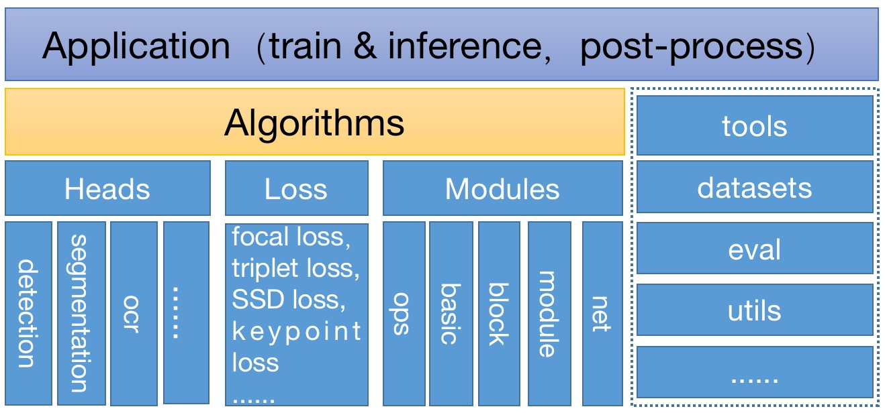
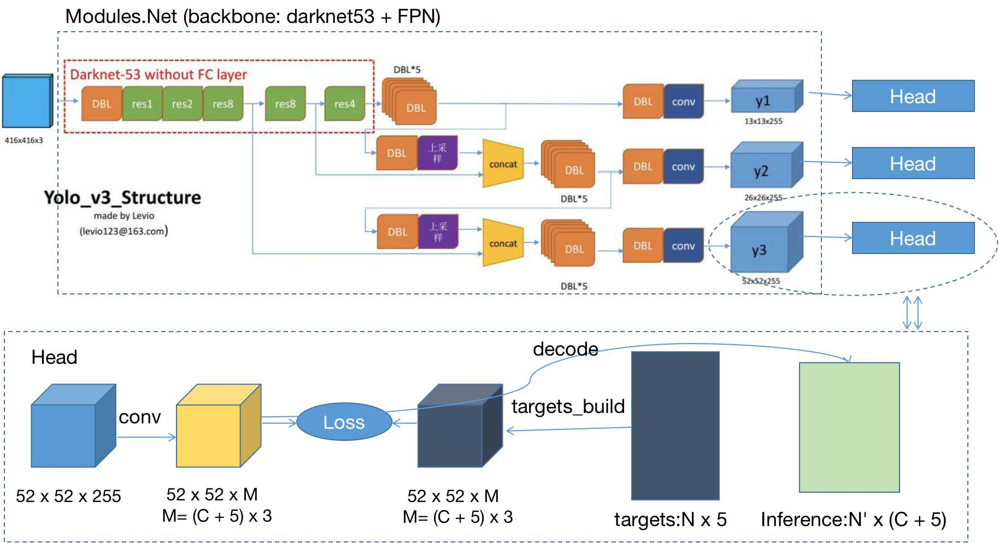

!!! Note: The cvLib is under devoloping. 
          We always welcome contributions to help make cvLib better. If you would like to contribute, please concat me.
          Mabay just a advice, it would help me a lot.

CVLib is an object detection toolbox based on Pytorch. Generally, we divide an object detection algorithm into two parts: backbone and head. Backbone is a feature extractor, maybe multi-scale features. Usually, Backbone network may conbine with a FPN block to enhance the features. Head is focusing on object detection algorithm itself. Head contains targets builder, loss, decoder and so on. It's very convenient to build a new algorithm just picking a backbone from our modules.net and picking a head from our heads. We also packed many useful blocks, all of which are in our modules.basic, modules.block, modules.module, so it will be so convenient and so quickly to use, such as building a new backbone network. We also provide some series alrorithms in our experiments, such as Cornetnet-Lite, SSD-Lite, Yolo-Lite.

## Introduction
The architecture diagram is showing below.  
<p align="center">
    
</p>
Commonly, the improvement to object-detection algorithm mainly centres on three aspects: backbone, loss and sprit. 
Backbone is a feature extractor, which is a black box. We don't know what's meaning the features are, but we should do all we can to design power, multi-scale features. All of the backbone network is put on `modules.net`. Here are three examples (not all) in picture below, and we will continue adding other power, new-style networks. But all `modules.net` should have the similar interface, please putting it in the mind, an images in and a feature list(or a tensor) out. In our `modules`, we have five sub-units: `ops, basics, block, module, net`, which contains many reusable blocks for building new net.
<p align="center">
    
</p>
Object detection task is a multi-task problem, classification and regression. Classification loss could be cross-entropy, binary-cross-entropy, focal loss and so on. Regression loss could be MSE, L1-smooth, L1, binary_cross_entropy, or some other uncertain loss as mentioned in [Bounding Box Regression with Uncertainty for Accurate Object Detection]https://arxiv.org/abs/1809.08545.
Object-detection spirit is most revolutionary, maybe as role of pioneer. Until now, We conclude five series spirit: fasterRCNN, SSD, Yolo, cornernet(keypoint-based), Fcos(segmentation-based), but something remain to do. Object-detection spirit is packed in `heads`. The `heads` includes targets_build, deocde, loss. Targets_build is for transforming origin labels (containing format transform, sampling of positive and negative examples, etc.), suitable for computing loss. Decode is for decoding the predicting tensors, transforming prdicting tensors to bbox. In the training phase, `*losses` is returned, and in the eval phase, `decoded bbox` is returned.
So, It's very convenient to build a new algorithm just picking a backbone from our `modules.net` and picking a head from our `heads`. There is an example of yolov3 built using the cvLib.
<p align="center">
    
</p>
But please remain it in mind, to make a algorithm works better, many experiments should be tried, for example, better data augumentation, better pretrain-model, better learning rate schedule, better dataset, and so on. So in the architecture diagram, there is a `Application` layer above `Algorithms` layer. Unfortunately, we dont't provide pretrained model explicitly evenly on COCO dataset, and it'll take me so much time. But I have demonstrated the experiments provided in `experiments` could work and convergert well on Pascal VOC dataset.

## Usage
- Dependencies:
    - python >= 3.5
    - torch >= 1.0
    - opencv-python
- Compile ops:
```
    cd modules/ops/_cpools
    python3 setup.py install --user
```

## Algorithms
- SSD-Lite
    - refering to [experiments/ssd/README.md](./experiments/ssd/README.md)

- Yolo-Lite
    - refering to [experiments/yolo/README.md](./experiments/yolo/README.md)

- Cornetnet-Lite (keypoint for object-detection)
    - remain developing
    
- FasterRCNN-Lite (two-stage object-detection)
    - to do
    
- Fcos-Lite (segmatation for object-detection)
    - to do

## interface document
- refering to [接口文档.md]
